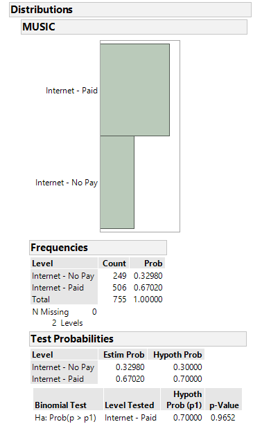

Spencer Retcher
[sretcher.github.io](https://github.com/sretcher/sretcher.github.io)


### One Sample Proportion Test

In a *Pew Internet and American Life Project Survey*, 755 randomly selected adults who use the Internet were asked if they have ever paid to access or download music. Of the 755 adults, 506 stated that they have paid for music. We will be using a one sample Z-test/Chi-Square Test of Independence to test whether the true porportion of all Internet using adults who have paid to access or download music exceeds .7. 

### Large Sample Test of Hypothesis about p
We will let p represent the probability that an adult who uses the Internet pays for music. For this test, we will use a level of significance of .01. 

Ho: p = .7

Ha: p > .7

### Conditions Required for a Valid Large-Sample Hypothesis for p

1. A random sample is selected from a binomial population.
2. The sample size is large (npo >= 15) and (nqo >= 15)

The number x of the 755 adults who pay for music is a binomial variable assuming that the survey for each adult is identical and that the sample was randomly selected from the population of adults who use the Internet. 

We know that the mean of the sampling distribution of p-hat is equal to p, so we will use p-hat as an unbiased estimator for p. Since p-hat is really the sample mean of successes for the binomial trials, we know that the sampling distribution will be normal for large sample sizes. 

To see if our sample is large enough, we need the number of failures and successes in the sample to be greater than 15. The null hypothesis value .7 is assumed to be the true value of p until the test indicates otherwise. Since (755)(.7) = 528.5 and (755)(1-.7) = 226.5, our sample size is large enough to make the sampling distribution of p-hat normal. Consequently, we can use the standard normal z as a test statistic. 

### Hypothesis Testing
For this experiment, the sample proportion is 506/755 = .67. We need to calculate the number of standard deviation units between p-hat and our null hypothesis value. Since the standard error of p-hat is sqrt(po\*qo/n), we can calculate our test statistic z = (.67 - .7) / sqrt(.7 * .3 / 755) = −1.79880913. Using a rejection region, we find that the z value corresponding to an area of .01 is 2.3263. Since -1.79880913 < 2.3263, we do not reject the null hypothesis. Using a table, we find that the p-value for our test statistic is .5 + .4633 = 0.9633. 

We construct a 99% one sided confidence interval with the formula .67 - 2.3263( sqrt (.67 \*.33 / 755) ) = (.63, Inf). For this formula, we use p-hat and q-hat since they approximate the value of corresponding parameters for large sample. We are 99% confident that the true value of p is within the interval (.63, Inf). Looking at the results from JMP and R, our results are very similiar. JMP and R conduct Chi-Square Tests of Independence, which are mathmatically the same as our z-test. 



```
prop.test(x=506, n = 755, p = .7,alternative = "greater",conf.level = .99)

# 1-sample proportions test with continuity correction

# data:  506 out of 755, null probability 0.7
# X-squared = 3.0527, df = 1, p-value = 0.9597
# alternative hypothesis: true p is greater than 0.7
# 99 percent confidence interval:
# 0.628629 1.000000
# sample estimates:
#        p 
# 0.6701987 
```
